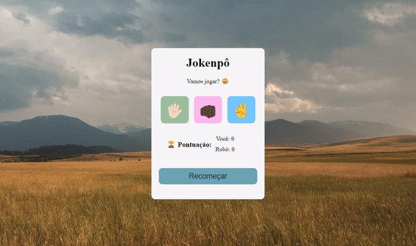

# Jogo Pedra, Papel e Tesoura (Jokenpô)

<h2>ℹ️ Sobre o Projeto</h2>

Este é um jogo simples de Pedra, Papel e Tesoura desenvolvido utilizando as tecnologias web padrão - HTML para estrutura, CSS para estilização e 
JavaScript para a lógica do jogo. O objetivo é criar uma experiência interativa onde o jogador pode escolher entre pedra, papel ou tesoura e competir contra o computador.

  

Neste jogo, o jogador faz sua escolha clicando em um dos botões, e a escolha do computador é gerada aleatoriamente. O sistema verifica as escolhas e determina o 
  vencedor, e o resultado é exibido na página..

<h2>🛠️ Tecnologias Utilizadas</h2>

<ul>
  <li>HTML5</li>
  <li>CSS3</li>
  <li>JavaScript</li>
</ul>

 
<h3 align=center>🎬 Demonstração do funcionamento das funcionalidades de navegação:</h3>

    

